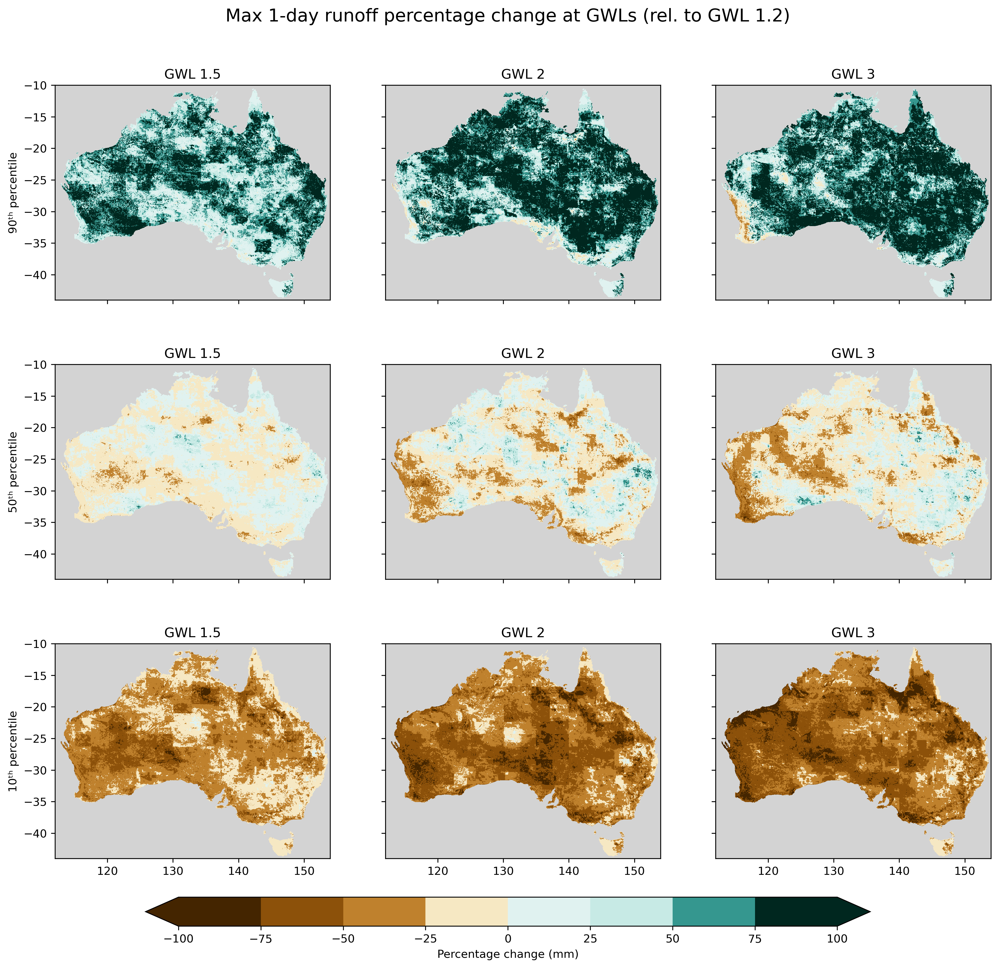

# ACS Hazard Team on Floods 

## Description
GitHub repository for ACS Hazard Team on Riverine Floods to store, track and develop code, data (timeseries, plots and maps).
Changes in the risk of riverine flooding are often associated with changes in the frequency or magnitude of extreme runoff. While extreme runoff does not directly translate to floods, this metric, in conjunction with information about land surface antecedent conditions and hydrological modelling, aid in the assessment of high-flow events that arise from exceptionally wet conditions.

Runoff data from National Hydrogical Projections (NHP) are used to calculate the flood indices for different Global Warming Levels (1,2, 1.5, 2, 3). The NHP comprise an ensemble of bias-corrected climate model data and derived hydrological projections (including runoff projections) at daily temporal and 0.05° × 0.05° spatial resolution for the period 1960–2099 and two emission scenarios (RCP 4.5 and RCP 8.5).

## Indices considered by the hazard team:
- Median annual maximum 1-day runoff
- Number of days exceeding the 90th percentile at GWL 1.2

## Products:
Status of the NCRA deliverables. 

The  dots represent the datasets used to compute indices:

In terms of the colors:
- :green_circle: The data is available in its final official form
- :yellow_circle: The data creation is currently in progress and available soon
- :red_circle: The data processing has not yet started
- :white_circle: Not intended for delivery/not applicable

(Table was last updated 5pm 01/07/2024)

| Index/metric | Timeseries | 2D |  2D change | 2D change - Multi-ensemble percentiles | (Notes) |
|-----         | :-:      |:-:      |:-:            |:-:            |-----    |
| Median annual maximum 1-day runoff |:green_circle:|:green_circle:|:green_circle:|:green_circle:|deliverable for 30 June   Data is at /g/data/ia39/ncra/flood/Runoff_Max1D |
|Annual total 90th percentile runoff|:green_circle:|:green_circle:|:green_circle:|:green_circle:|deliverable for 30 June   Data to be transferred to /g/data/ia39/ncra/flood/Runoff_annual_total_90perc|

**Figures:** Example figure for 'Maximum 1-day runoff percentage change relative to GWL 1.2 for the 10th, 50th and 90th percentile of the multi-model ensemble:

**Tables:** Example table for Maximum 1-day runoff percentage change "mean" relative to GWL 1.2 for the 10th, 50th and 90th percentile of the multi-model ensemble for all NCRA regions:

**Plots:** Example plot for Maximum 1-day runoff percentage change "mean" relative to GWL 1.2 for the 10th, 50th and 90th percentile of the multi-model ensemble for all NCRA regions:

## Roadmap
The data for the outputs specified in the columns was produced using this workflow:

## References
* Peter, J., Vogel, E., Sharples, W., Bende-Michl, U., Wilson, L., Hope, P., Dowdy, A., Kociuba, G., Srikanthan, S., Duong, V. C., Roussis, J., Matic, V., Khan, Z., Oke, A., Turner, M., Baron-Hay, S., Johnson, F., Mehrotra, R., Sharma, A., Thatcher, M., Azarvinand, A., Thomas, S., Boschat, G., Donnelly, C., and Argent, R.: Continental-scale bias-corrected climate and hydrological projections for Australia, Geosci. Model Dev., 17, 2755–2781, https://doi.org/10.5194/gmd-17-2755-2024, 2024. 
* https://awo.bom.gov.au/

## Contributing
Open to contributions. 

## Authors and acknowledgment
Hazard team:
- [ ] Katy Bahramian (Bureau of Meteorology, lead)
- [ ] Wendy Sharples (Bureau of Meteorology, contributor)
